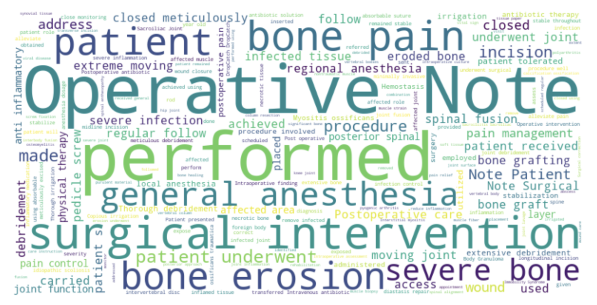
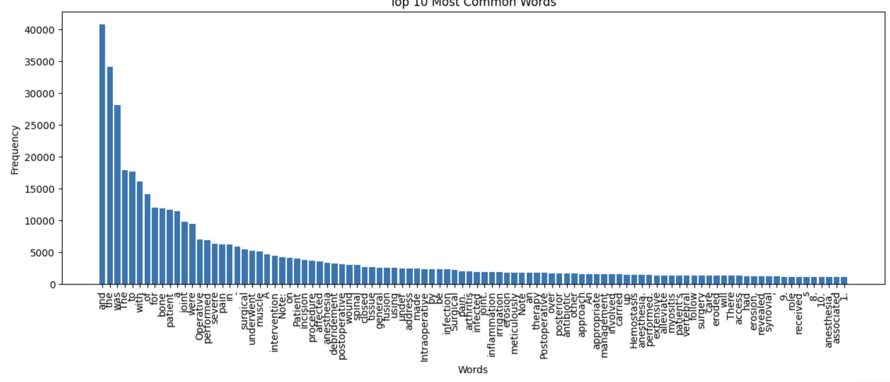
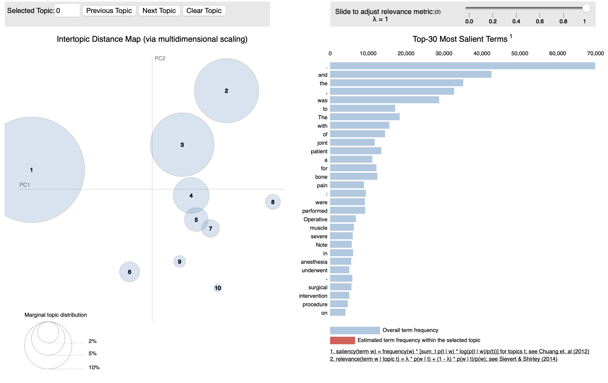
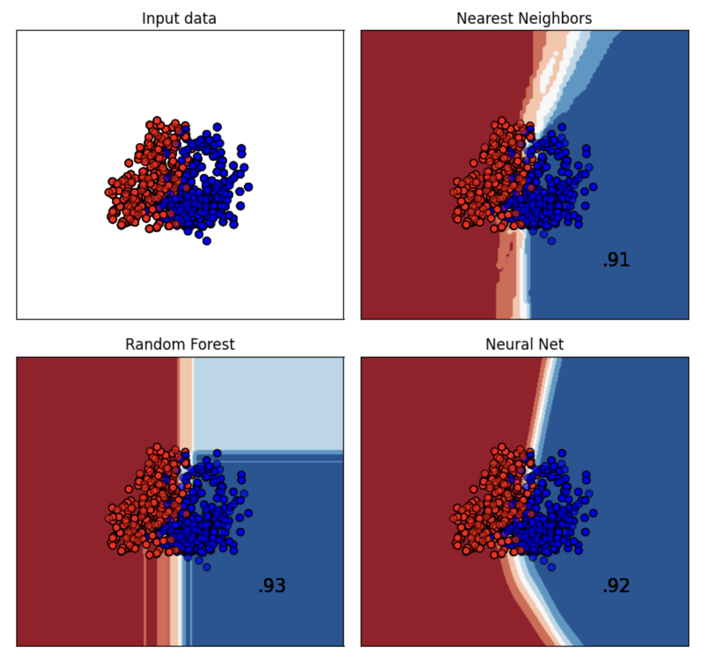
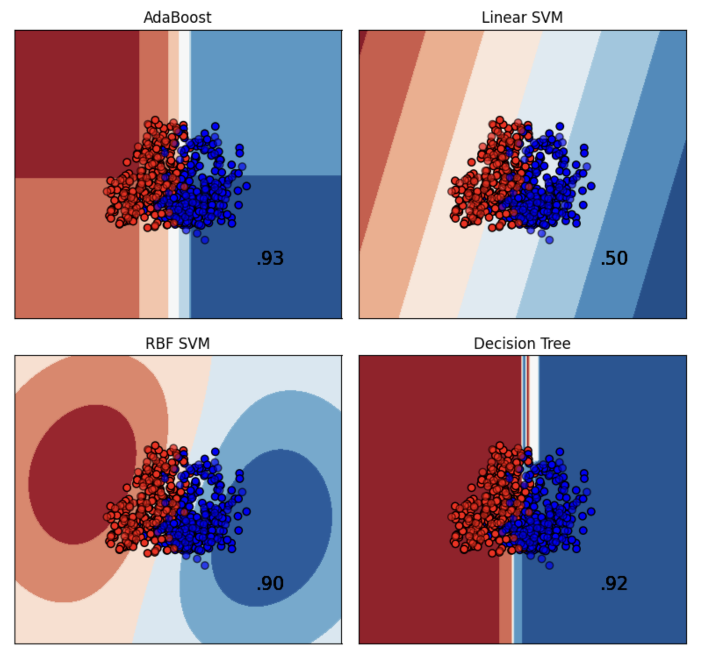
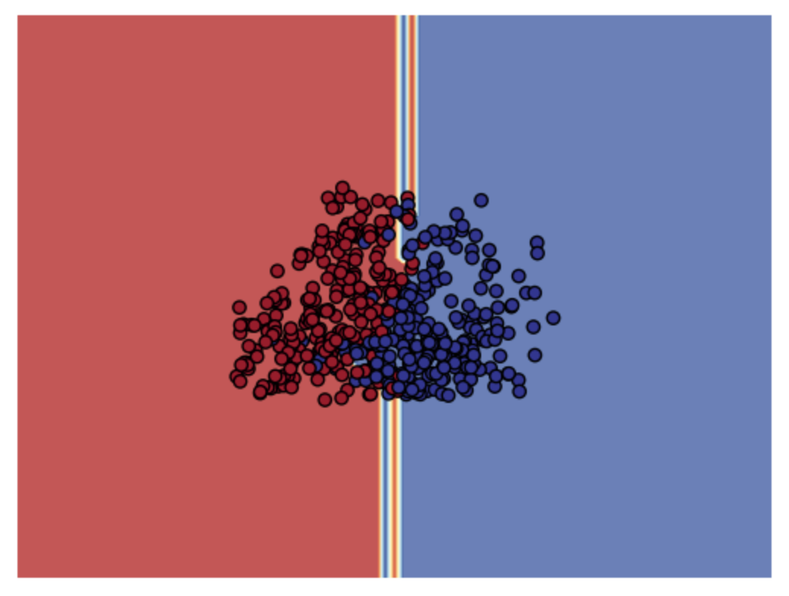
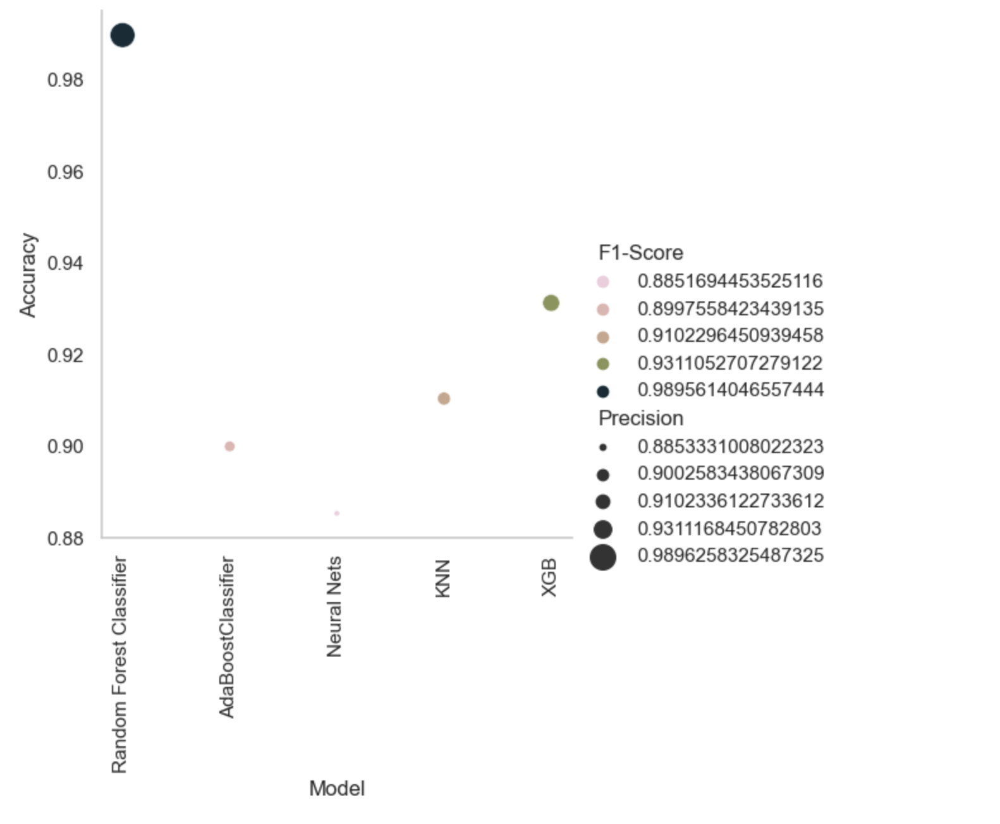

# MedicalLM
## Classification system for operative notes

In medical coding, an operative note is a documentation that describes the details of a surgical procedure performed on a patient. It provides a comprehensive account of the surgical intervention, including the indications for the procedure, the surgical techniques used, and any findings or complications encountered during the operation.

ICD-10 (International Classification of Diseases, 10th Revision) is a system used for medical coding to classify diseases, injuries, and other health conditions. It is primarily used for coding diagnoses rather than procedures. 

This repo aims to classify hundreds of ICD-10 notes for insurance purposes and even research and development of a well aligned classifier. 

## Dataset
The dataset was not available on the internet which made this project extremely difficult. So the idea was to generate synthetic data from LLMs such as OpenAI's ChatGPT API, Falcon-7b et cetera. 

The dataset was automatically collected and stored on a .docx file. The file had a particular structure where all the classes of the ICD10 codes were stored as "heading2" while the operative notes were collected as "normal" text. This structure made it easy for data engineering and for a creating robust preprocessing pipeline. 

Majority of the data is collected using "prompt engineering" which allowed us collect data on a large scale. But due to the rising cost of generated tokens the dataset was not fully collected. 

For the same reason we partially collected the M13 series. 

### Prompt Engineering
To generate the data we relied heavily on prompt engineering. A good prompt can generate good synthetic data and can reduce time and effort. We used OpenAI's `model="gpt-3.5-turbo-16k-0613"` and `"gpt-4"` for prompt engineering. 

One of the approaches was to feed a sample of operative notes and ask the model to frame questions or prompts to generate valuable synthetic data. 

For instance we got a variety of responses but we choose the best of 10 and finetuned according to our likings. Here are some of the prompts that were used for generating synthetic data:

1. Prompt: 
Generate a synthetic operative note for a patient admitted with a diagnosis of ICD10 code K80 - "Cholelithiasis" (gallstones).

2. Prompt: 
Create an operative note for an individual who has undergone a procedure related to ICD10 code I25 - "Chronic ischemic heart disease".

3. Prompt: 
Write a surgical note for a patient who has been diagnosed with ICD10 code M16 - "Osteoarthritis of hip".

4. Prompt:
Generate a synthetic operative note for a procedure conducted on a patient with an ICD10 code M17 - "Osteoarthritis of the knee".

5. Prompt: 
Formulate an operative report for a patient who has been treated for ICD10 code E10 - "Type 1 diabetes mellitus".

6. Prompt:
Provide a surgical summary for a patient diagnosed with ICD10 code I10 - "Essential (primary) hypertension".

7. Prompt:
Write an operative note for a surgery linked with ICD10 code K21 - "Gastro-esophageal reflux disease".

8. Prompt:
Generate a surgical report for a procedure related to an individual presenting with an ICD10 code E78.5 - "Hyperlipidemia, unspecified".

9. Prompt:
Develop an operative note for a patient diagnosed with an ICD10 code C61 - "Malignant neoplasm of prostate".

10. Prompt:
Produce a detailed operative note for a patient who underwent a procedure relevant to ICD10 code J45 - "Asthma".

### Text augmentation

As mentioned before because of the financial restictions we had to stop data generation. But to increase the density of the data we had to come with text augmentation approches. Couple of them are text summarization and paraphrasing. We used the Huggingface library to achieve text augmentation, although it was a time consuming process. 

| model-name                 | action     | definition                                       |
|----------------------------|------------|--------------------------------------------------|
| bert-base-uncased          | substitute | Insert word by contextual word embeddings        |
| t5-base                    | summary    | Summarize the text                               |
| facebook/bart-large-cnn    | summary    | Summarize the text with a min and max word length|
| tuner007/pegasus_paraphrase| paraphrase | Paraphrase the text                              |
    

### Data engineering and preprocessing

For effective and robust machine learning model we made sure that the dataset doesn't carry unwanted and redundant information. So we took time to maunally access the data as much as possible to find unwanted phrases. Since we generated the data there was a high probability that the phrases might repeat itself. This is one of the major drawback of the LLM. But we also observed there was less to no duplicacy since some of the repeated or similar phrases were hidden in the paragraph pertaining to the operative notes. 

Such phrases don't raise much concerns unless there are the part of the entire paragraph. But other phrases which these LLMs yield as a part of their conversational capabilities could possibly raise concerns. One of such phrases are "Certainly, here are 10 samples...". Apart from that there were other reduntant words which had to be discovered. 

For data exploration we used three major algorithms:
1. Word Cloud  
2. Word Count
3. LDA
 

#### Word Cloud
We used word cloud algorithm to generate visual representations of text data, where the size of each word is proportional to its frequency or importance in the text. The algorithm analyzes the input text, counts the occurrence of each word, and determines how to arrange and size the words in the resulting word cloud.

With word cloud we discovered important keywords that could contribute more toward the training and final classification.

### Word Count
We used word cloud to see words that have high frequency in the data. 

Here we discovered series numbers like "1.", "2.", et cetera that was not required at all. These were generated as a response to the prompt. 

###  Latent Dirichlet Allocation 
LDA was to discover topics that hidden. Latent variables or latent factors are variables that cannot be directly observed or measured but are inferred or estimated based on other observed variables or indicators. LDA which is a probabilistic topic modeling technique is extremely handy to uncover latent topics in a collection of documents.

It generally creates a topic and inform what words or phrases were predominantly used in the topic. 

In the end we found these words to be reduntant and to be removed. 
`word_to_remove = ["1.", "2.", "3.", "4.", "5.", "6.", "7.", "8.", "9.", "10.", 'Certainly!', '00', '00 00', '00 00 00']`

## Embeddings
To convert the text into embeddings we used Term Frequency-Inverse Document Frequency Vectorization from the Scikit-Learn library. The whole idea of TF-IDF is to measure how important a word is in a document, relative to how important it is in other documents.

Here are some of the important words yeilded by TfIdVectorizer:
`Feature names or Tokens: ['abscess', 'abscess evacuation', 'absorbable', 'absorbable sutures', 'access', 'access affected', 'accessed', 'achieve', 'achieved', 'achieved using', 'achieved wound', 'achieved wound closed', 'additional', 'address', 'address bone', 'address severe', 'address severe bone', 'addressed', 'adequate', 'adjusted', 'administered', 'advanced', 'advised', 'affected', 'affected area', 'affected joint', 'affected muscle', 'affected role', 'affected vertebral', 'affecting', 'agent', 'aimed', 'alignment', 'alleviate', 'alleviate pain', 'alleviate severe', 'alleviate severe bone', 'allograft', 'allowing', 'anaesthesia', 'analgesics', 'analysis', 'anesthesia', 'anesthesia administered', 'anesthesia appropriate', 'anesthesia appropriate dosage', 'anesthesia care', 'anesthesia dosage', 'anesthesia intraoperative', 'anesthesia intravenous', 'anesthesia patient', 'anesthetic', 'ankle', 'ankle joint', 'anterior', 'anterior approach', 'anti', 'anti inflammatory', 'anti inflammatory medications', 'anti tuberculous', 'anti tuberculous therapy', 'antibiotic', 'antibiotic impregnated', 'antibiotic solution', 'antibiotic therapy', 'antibiotics', 'antibiotics initiated', 'antifungal', 'antifungal therapy', 'antimicrobial', 'antimicrobial therapy', 'applied', 'appointments', 'approach', 'approach employed', 'approach used', 'approach utilized', 'appropriate', 'appropriate dosage', 'appropriate postoperative', 'area', 'areas', 'arthritis', 'arthritis associated', 'arthritis polyarthritis', 'arthritis related', 'arthrodesis', 'arthropathy', 'arthroplasty', 'arthroscopic', 'arthroscopic synovectomy', 'arthroscopy', 'arthrotomy', 'arthrotomy performed', 'articular', 'assess', 'assessed', 'assessment', 'assessment revealed', 'assessments', 'associated', 'associated arthritis', 'associated bone', 'associated bone erosion', 'atrophy', 'augmentation', 'bacterial', 'bacterial agent', 'based', 'based severity', 'bilateral', 'biopsy', 'block', 'blood', 'blood flow', 'bodies', 'body', 'body granuloma', 'body granuloma excision', 'bone', 'bone abscess'...`

We also used Principal component analysis to reduce the given matrix and make it much more robust and effective. 

Once reduced we created training and testing datasets. 

## Model
For training we used a variety of models. We assumed that the project doesn't require Deep learning model. Although we them initially we turned out that good with the lack of data. So we decided to use various shallow learning models. 

As such we used the following models:

`names = [
    "Nearest Neighbors",
    "Random Forest",
    "Neural Net",
    "AdaBoost",
    "Linear SVM",
    "RBF SVM",
    "Decision Tree"]`

We used grid search to find the best hyperparameter in a small subset of data. The result was a list of classifier with the following parameters:

`classifiers = [
    KNeighborsClassifier(algorithm = 'auto', n_neighbors = 7, weights = 'uniform'),
    RandomForestClassifier(max_depth = None, min_samples_split = 5, n_estimators = 100, random_state=23),
    MLPClassifier(activation = 'relu', 
                  alpha = 0.0001, 
                  hidden_layer_sizes = (50, 100, 50), 
                  learning_rate = 'constant', 
                  solver = 'adam', random_state=23),
    AdaBoostClassifier(learning_rate = 0.1, n_estimators = 50, random_state=23),
    SVC(kernel="linear", C=0.025, random_state=23),
    SVC(gamma=2, C=1, random_state=23),
    DecisionTreeClassifier(max_depth=5, random_state=23),
]`

Finally, we evaluated with model will yeild the best decision boundary with respect to the input data for binary classification. 

We also tried the same with XGBoost. 

| S.no |  Model                    | Accuracy | Precision | Recall   | F1-Score |
|------|---------------------------|----------|-----------|----------|----------|
| 0	   | Random Forest Classifier  | 0.989562 | 0.989626  | 0.989575 | 0.989561 |
| 1	   | AdaBoostClassifier	       | 0.899791 | 0.900258  | 0.899756 | 0.899756 |
| 2	   | Neural Nets	           | 0.885177 | 0.885333  | 0.885199 | 0.885169 |
| 3	   | KNN	                   | 0.910230 | 0.910234  | 0.910234 | 0.910230 |
| 4	   | XGB	                   | 0.931106 | 0.931117  | 0.931102 | 0.931105 |

#### Training

With the results above we decided to train the model on Random Forest and XGBoost. In addition, we also trained the model on Logistic regression with the full (multilabel) dataset. 

This is the model performance on the entire dataset. 
| S.no |  Model                | Accuracy | Precision | Recall   | F1-Score |
|------|-----------------------|----------|-----------|----------|----------|
| 0	   | XGBoost               | 0.989562 | 0.989626  | 0.989575 | 0.989561 |
| 1	   | Random Forest	       | 0.899791 | 0.900258  | 0.899756 | 0.899756 |
| 2	   | Logistic Regression   | 0.885177 | 0.885333  | 0.885199 | 0.885169 |

#### Inference

For inference we used the unseen dataset which was not preprocessed with training and testing batch. This ensures that there is less to no data leakage. We used the same preprocessing pipeline and then fed the data into the trained model. The results were extremely promising. 

`random_number = np.random.randint(0, len(test))`

`inp = test.iloc[random_number]`

`result = inference(inp.notes, model)`

`print(f"Prediction: {result[0]}")`

`print(f"Ground Truth: {inp.codes}")`

> Prediction: M01.8

> Ground Truth: M01.8

## Conclusion
This was a small project that could be possibly scaled up with deep neural networks. The scaling requires a massive amount of data -- generate or real world. But in any case training a model more than 60 labels will require extensive processing and training. As ICD10 codes have more that 1000 codes a deep neural network will be suffice. An important observation that we made was that each label must have atleast 5000 samples if training on neural nets. But if the data is small then shallow machine learning approach is enough. 

## ToDo:
1. Collect more data for all ICD10 codes. 
2. Fine tune an existing model such medBert. 
3. Generate good embeddings for robust multilabel classification. 
